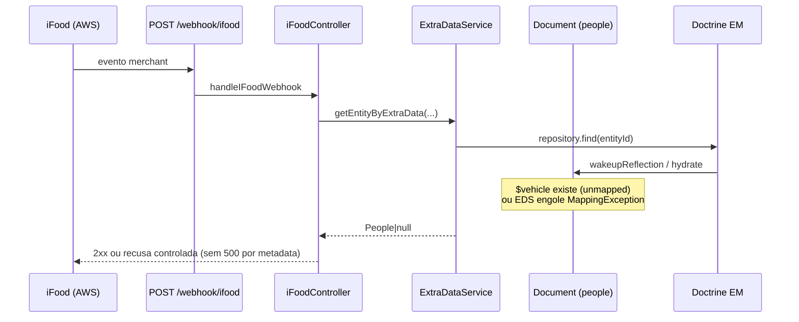

# Document — compatibilidade de metadata `$vehicle` (Doctrine)

Documentação técnica da entrega **api-community#88** (hotfix de produção).

## Contexto

`api-platform-people` é o backend de pessoas e vínculos (`People`, `PeopleLink`, `Document`) usado por CRM, MANAGER, POS, SHOP e integrações de marketplace (incluindo o webhook iFood).

A entidade `ControleOnline\Entity\Document` mapeia a tabela `document` (documento de PF/PJ: CPF, CNPJ, etc.). Em algum momento do histórico, o ClassMetadata Doctrine em cache de produção passou a referenciar a propriedade `Document::$vehicle`. Essa propriedade **não existe** na classe carregada nem como coluna na tabela `document`.

Quando o Doctrine faz `ClassMetadata::wakeupReflection` (tipicamente no primeiro `find()` que hidrata um grafo envolvendo `Document` / `People`), ocorre:

```text
ReflectionException: Property ControleOnline\Entity\Document::$vehicle does not exist
```

O request inteiro vira HTTP 500.

## Incidente (produção)

| Item | Valor |
| --- | --- |
| Ambiente | `api.controleonline.com` (prod) |
| Endpoint | `POST /webhook/ifood` (rota `ifood_webhook`) |
| Status | 500 |
| Janela observada | 2026-08-31 → 2026-09-03 (recorrente enquanto o iFood reenvia) |
| Exceção | `ReflectionException` em `doctrine/orm` `PropertyAccessorFactory` / `wakeupReflection` |
| Mensagem | `Property ControleOnline\Entity\Document::$vehicle does not exist` |
| Cadeia de produto | `iFoodController::handleIFoodWebhook` → `resolveProviderByMerchantId` / `resolveWebhookSecrets` → `ExtraDataService::getEntityByExtraData()` → `EntityRepository::find()` |

Não é o mesmo bug de:

- [api-community#83](https://github.com/ControleOnline/api-community/issues/83) — coluna `people.deleted` ausente no schema do tenant
- [api-community#59](https://github.com/ControleOnline/api-community/issues/59) — dependências ausentes no controller iFood

## Causa raiz

Metadata Doctrine **órfã / stale** em produção: o ClassMetadata em cache ainda descreve a associação `Document::$vehicle`, mas a classe PHP atual (e a tabela `document`) não têm essa propriedade/coluna. O primeiro `find()` no caminho do webhook dispara o wakeup e o request cai.

Não há evidência de payload iFood, token ou PII como gatilho — qualquer resolução de merchant via `ExtraDataService` que hidrate `Document` reproduz o 500 enquanto a metadata estiver inconsistente.

## Correção aplicada

Duas camadas defensivas (ambas necessárias):

### 1. `api-platform-people` — entidade `Document`

Restaurado o campo de compatibilidade **sem mapeamento ORM**:

```php
/**
 * Compatibility field for stale Doctrine ClassMetadata that still
 * references Document::$vehicle (prod ReflectionException on webhook iFood).
 * Not mapped — no vehicle column on `document`.
 */
private mixed $vehicle = null;
```

Com accessors `getVehicle()` / `setVehicle()` mínimos. Efeitos:

- `wakeupReflection` encontra a propriedade e não lança `ReflectionException`
- Sem `#[ORM\...]` → sem coluna, sem JOIN, sem mass-assignment
- Sem `Groups` de serialização → não aparece na API

Teste de regressão: `DocumentVehicleCompatibilityTest` (existência da propriedade + accessors).

### 2. `api-platform-common` — `ExtraDataService::getEntityByExtraData()`

O `find()` após localizar o `ExtraData` ficou protegido:

```php
try {
    return $this->manager->getRepository($class->getName())->find($extraData->getEntityId());
} catch (\ReflectionException
    | \Doctrine\Persistence\Mapping\MappingException
    | \Doctrine\ORM\Mapping\MappingException $exception) {
    // Stale Doctrine metadata (e.g. Document::$vehicle) must not 500 webhooks.
    return null;
}
```

Comportamento:

- Em metadata saudável: comportamento anterior (retorna a entidade).
- Em metadata órfã: retorna `null` em vez de 500.
- O webhook iFood segue o fallback de secrets / recusa controlada (não derruba o request).

Teste: `ExtraDataServiceTest::testGetEntityByExtraDataReturnsNullWhenDoctrineMetadataIsOrphan`.

## Fluxo afetado (visão de módulos)



| Módulo | Papel neste fluxo | O que **não** deve fazer |
| --- | --- | --- |
| `api-platform-people` | Dono da entidade `Document` e schema `document` | Mapear coluna `vehicle` inexistente; expor `$vehicle` em Groups |
| `api-platform-common` | `ExtraDataService` (lookup genérico por extra-data) | Propagar `ReflectionException`/`MappingException` de metadata órfã para o request |
| módulo `integration` (iFood) | Controller + resolução de merchant/secrets | Logar payload completo ou segredo do webhook |
| UI (qualquer `APP_TYPE`) | N/A — sem tela neste incidente | — |

## Como validar em um passo

1. No host com o código publicado: `POST /webhook/ifood` (KEEPALIVE ou evento com assinatura válida de merchant conhecido).
2. Resposta **não** pode ser 500 com `Document::$vehicle does not exist`.
3. Se o merchant não resolver: resposta controlada (fallback), sem `ReflectionException`.
4. PHPUnit nos módulos: `DocumentVehicleCompatibilityTest` + `ExtraDataServiceTest::testGetEntityByExtraDataReturnsNullWhenDoctrineMetadataIsOrphan`.

## Referências cruzadas

| Destino | Link |
| --- | --- |
| Issue | https://github.com/ControleOnline/api-community/issues/88 |
| ExtraDataService (common) | https://github.com/ControleOnline/api-platform-common/wiki/ExtraDataService-Orphan-Metadata |
| People soft-delete (#83, outro 500 iFood) | https://github.com/ControleOnline/api-platform-people/wiki/People-Soft-Delete-Schema |
| Wiki API (Home) | https://github.com/ControleOnline/api-community/wiki |
| Código `Document` | `src/Entity/Document.php` em `api-platform-people` |
| Código `ExtraDataService` | `src/Service/ExtraDataService.php` em `api-platform-common` |

## Fora de escopo desta página

- Contrato de eventos iFood além do necessário para não 500
- Limpeza de ClassMetadata em cache de host (infra / opcache / Doctrine cache) — mitigação de código cobre o request mesmo com cache stale
- UI ou Central de Ajuda (sem jornada de cliente)

Cópia versionada no Git (quando existir): `docs/technical/Document-Vehicle-Metadata-Compatibility.md`
